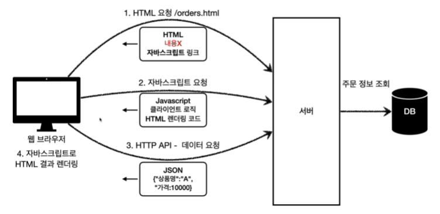

# HTML, HTTP API, CSR, SSR
## 1. 정적 리소스
* 고정된 HTML 파일, CSS, JS, 이미지, 영상 등을 제공
* 주로 웹 브라우저

## 2. HTML 페이지
* 동적으로 필요한 HTML 파일을 생성해서 전달
* 웹 브라우저 : HTML 해석
* 

## 3. HTTP API
* HTML이 아니라 데이터를 전달
* 주로 JSON 형식 사용
* 다양한 시스템에서 호출
* 
* 다양한 시스템에서 호출
* 데이터만 주고 받음, UI 화면이 필요하면 클라이언트가 별도 처리
* 앱, 웹 클라이언트, 서버 to 서버
* 
* 다양한 시스템 연동
  * 주로 JSON 형태로 데이터 통신
  * UI 클라이언트 접점
    * 앱 클라이언트(아이폰, 안드로이드, PC 앱)
    * 웹 브라우저에서 자바스크립트를 통한 HTTP API 호출
    * React, Vue.js 같은 웹 클라이언트
  * 서버 to 서버
    * 주문 서버 -> 결제 서버
    * 기업간 데이터 통신

  

---

## 서버사이드 렌더링, 클라이언트 사이드 렌더링
* SSR - 서버 사이드 렌더링
  * HTML 최종 결과를 ***서버에서 만들어서*** 웹 브라우저에 전달
  * 주로 정적인 화면에 사용(복잡하지 않을 때)
  * 관련기술 : JSP, 타임리프 -> 백엔드 개발자
* CSR - 클라이언트 사이드 랜더링
  *  
  * HTML 결과를 자바스크립트를 사용해 웹 브라우저에서 동적으로 생성해서 적용
  * 주로 동적인 화면에 사용, 웹 환경을 마치 앱 처럼 필요한 부분부분 변경할 수 있음
  * ex) 구글 지도, Gmail, 구글 캘린더
  * 관련기술 : React, Vue.js -> 웹 프론트엔드 개발자
* 참고
  * React, Vue.js를 CSR + SSR 동시에 지원하는 웹 프레임워크도 있다
  * SSR을 사용하더라도, 자바스크립트를 사용해서 화면 일부를 동적으로 변경 가능