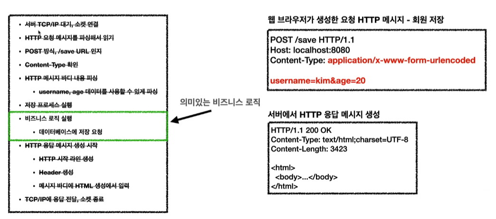
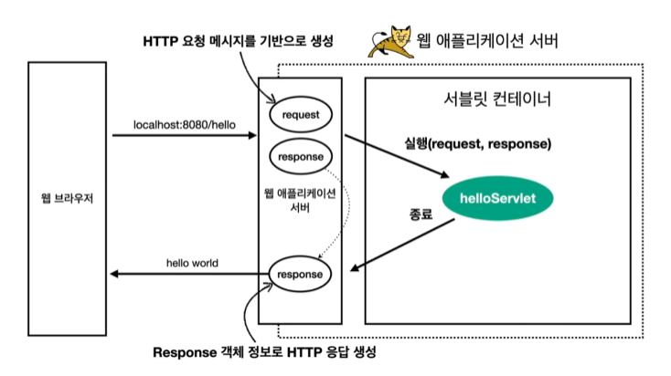
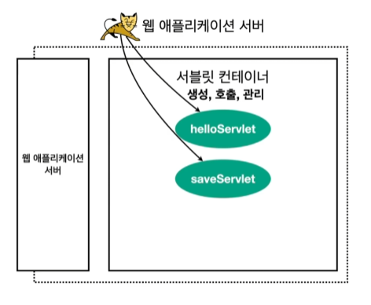

# 서블릿(Servlet)
> "클라이언트의 요청을 처리하고, 그 결과를 반환하는 Servlet 클래스의 구현 규칙을 지킨 자바 웹 프로그래밍 기술"
> <br> 간단히 말해서, 서블릿이란 자바를 사용하여 웹을 만들기 위해 필요한 기술입니다. 그런데 조금 더 들어가서 설명하면 클라이언트가 어떠한 요청을 하면 그에 대한 결과를 다시 전송해주어야 하는데, 이러한 역할을 하는 자바 프로그램입니다.
* 
* 위 사진에서 비즈니스 로직을 제외한 모든 일을 다 지원해준다.

<br>

### 특징

```java
import jakarta.servlet.annotation.WebServlet;
import jakarta.servlet.http.HttpServlet;
import jakarta.servlet.http.HttpServletRequest;
import jakarta.servlet.http.HttpServletResponse;

@WebServlet(name = "helloServlet", urlPatterns = "/hello")
public class HelloServlet extends HttpServlet {

    @Override
    protected void service(HttpServletRequest request, HttpServletResponse response) {
        //애플리케이션 로직
    }
}
```

* urlPatterns(/hello)의 URL이 호출되면 서블릿 코드가 실행
* HTTP 요청 정보를 편리하게 사용할 수 있는 HttpServletRequest
* HTTP 요청 정보를 편리하게 제공할 수 있는 HttpServletResponse
* 개발자는 HTTP 스펙을 매우 편리하게 사용

<br>

### HTTP 요청, 응답 흐름
* 
* HTTP 요청시
  * WAS는 Request, Response 객체를 새로 만들어서 서블릿 객체 호출
  * 개발자는 Request 객체에서 HTTP 요청 정보를 편리하게 꺼내서 사용
  * 개발자는 Response 객체에 HTTP 응답 정보를 편리하게 입력
  * WAS는 Response 객체에 담겨있는 내용으로 HTTP 응답 정보를 생성

<br>

### 서블릿 컨테이너
* 
* 톰캣처럼 서블릿을 지원하는 WAS를 서블릿 컨테이너라고 한다.
* 서블릿 컨테이너는 서블릿 객체를 생성, 초기화, 호출, 종료하는 생명주기 관리
* 서블릿 객체는 ***싱글톤으로 관리***
  * 고객의 요청이 올 때 마다 계속 객체를 생성하는 것은 비효율적
  * 최초 로딩 시점에 서블릿 객체를 미리 만들어두고 재활용
  * 모든 고객 요청은 동일한 서블릿 객체 인스턴스에 접근
  * ***공유 변수 사용 주의(싱글톤 객체이기 때문에)***
  * 서블릿 컨테이너 종료시 함께 종료
* JSP도 서블릿으로 변환 되어서 사용
* 동시 요청을 위한 쓰레드 처리 지원

