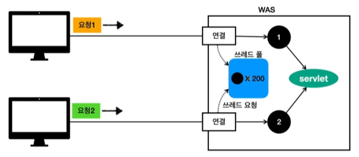
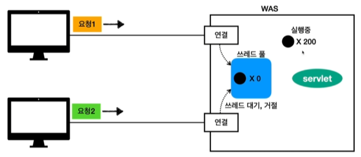

# 동시 요청 - 멀티 쓰레드
## 쓰레드(Thread)
* 애플리케이션 코드를 하나하나 순차적으로 실행하는 것은 쓰레드
* 자바 메인 메서드를 처음 실행하면 main이라는 이름의 쓰레드가 실행
* 쓰레드가 없다면 자바 애플리케이션 실행이 불가능
* 쓰레드는 한번에 하나의 코드 라인만 수행
* 동시 처리가 필요하면 쓰레드를 추가로 생성

 

### 1. 단일 요청 - 쓰레드 하나 사용
* 클라이언트 요청 -> WAS 연결 -> 쓰레드 할당 -> Servlect 호출 -> Servlet 응답
* 

### 2. 다중 요청 - 쓰레드 하나 사용
* 

### 3. 요청 마다 쓰레드 생성
* 
* 장점
  * 동시 요청을 처리할 수 있다.
  * 리소스(CPU, 메모리)가 허용할 때 까지 처리가능
  * 하나의 쓰레드가 지연 되어도, 나머지 쓰레드는 정상 동작한다.
* 단점
  * 쓰레드는 생성 비용이 매우 비싸다.
    * 고객의 요청이 올 때 마다 쓰레드를 생성하면, 응답 속도가 늦어진다.
  * 쓰레드는 컨텍스트 스위칭(사실 cpu 코어 수 만큼 쓰레드도 돌아가는데 번갈아 가면서 빠르게 처리하는 것) 비용이 발생한다.
  * 쓰레드 생성에 제한이 없다.
    * 고객 요청이 너무 많이 오면, CPU, 메모리 임계점을 넘어서 서버가 죽을 수 있다.

### 4. 쓰레드 풀
* 
* 

    ### 1. 요청 마다 쓰레드 생성의 단점 보완
  * 특징
    * 필요한 쓰레드를 쓰레드 풀에 보관하고 관리한다.
    * 쓰레드 풀에 생성 가능한 쓰레드의 최대치를 관리한다. 톰캣은 최대 200개 기본 설정 (Max Connection 변경 가능)
  * 사용
    * 쓰레드가 필요하면, 이미 생성되어 있는 쓰레드를 쓰레드 풀에서 꺼내서 사용한다.
    * 사용을 종료하면 쓰레드 풀에 해당 쓰레드를 반납한다.
    * 최대 쓰레드가 모두 사용중이어서 쓰레드 풀에 쓰레드가 없으면?
      * 기다리는 요청은 거절하거나 특정 숫자만큼만 대기하도록 설정할 수 있다.
  * 장점
    * 쓰레드가 미리 생성되어 있으므로, 쓰레드를 생성하고 종료하는 비용(CPU)이 정약되고, 응답 시간이 빠르다.
    * 생성 가능한 쓰레드의 최대치가 있으므로 너무 많은 요청이 들어와도 기존 요청은 안전하게 처리할 수 있다.

    ### 2. 실무 팁
  * WAS의 주요 튜닝 포인트는 최대 쓰레드(max thread) 수이다.(극적인 효과를 볼 확률이 굉장히 높다.)
  * 이 값을 너무 낮게 설정하면?
    * 동시 요청이 많으면, 서버 리소스는 여유롭지만(ex, cpu 5%), 클라이언트는 금방 응답 지연
  * 이 값을 너무 높게 설정하면?
    * 동시 요청이 많으면, CPU, 메모리 리소스 임계점 초과로 서버 다운
  * 장애 발생시?
    * 클라우드면 일단 서버부터 늘리고, 이후에 튜닝
    * 클라우드가 아니면 열심히 튜닝

    ### 3. 쓰레드 풀의 적정 숫자
  * 적정 숫자는 200개, 300개 등등 확실히 정해둘 수 없다.
  * 애플리케이션 로직의 복잡도, CPU, 메모리, IO 리소스 상황에 따라 모두 다르다.
  * 성능 테스트가 필수!
    * 최대한 실제 서비스와 유사하게 성능 테스트 시도
    * 툴 : 아파치 ab, 제이미터, nGrinder
  * 추후 트래픽을 감당하지 못하는 경우 병목 포인트들을 찾아서 튜닝