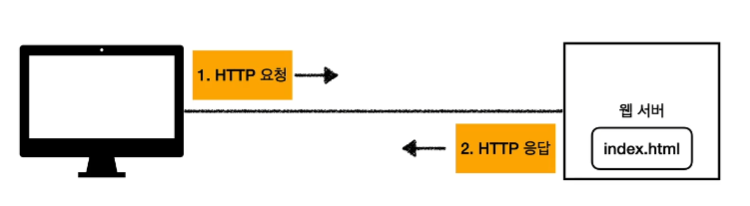
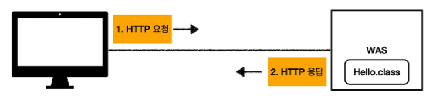
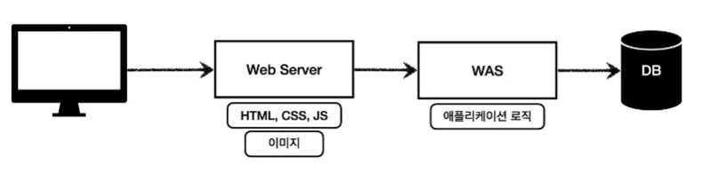
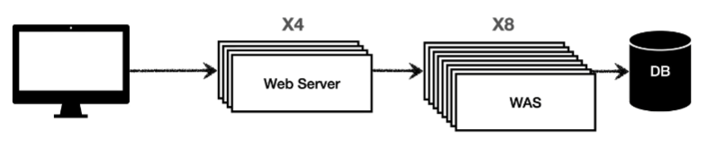

# 웹 서버, 웹 애플리케이션 서버
## 1. 웹 - HTTP 기반
### 웹 브라우저(클라이언트) -> 인터넷 -> 서버 -> 인터넷 -> 클라이언트
#### 클라이언트에서 웹 서버로 전송할때 서버에서 클라이언트로 데이터를 응답할때, 이때 다 HTTP라는 프로토콜을 기반으로 동작한다.
#### 그래서 웹에서는 모든 것이 HTTP를 기반으로 데이터를 주고 받는다.
1. HTML, TEXT
2. IMAGE, 음성, 영상, 파일
3. JSON, XML(API)
4. 거의 모든 형태의 데이터 전송 가능
5. 서버간에 데이터를 주고 받을 때도 대부분 HTTP 사용
6. 지금은 HTTP의 시대!

## 2. 웹 서버(Web Server)
* HTTP 프로토콜 기반으로 동작
* 정적 리소스 제공, 기타 부가기능
* 정적(파일) HTML, CSS, JS, 이미지, 영상
* 대표적인 예) NGINX, APACHE
* 

## 3. 웹 애플리케이션 서버(WAS - Web Application Server)
* HTTP 프로토콜 기반으로 동작
* 웹 서버 기능 포함 + (정적 리소스 제공 가능)
* 프로그램 코드를 실행해서 애플리케이션 로직 수행
  * 동적 HTML, HTTP API(JSON)
  * 서블릿, JSP, 스프링 MVC
* 대표적인 예) Tomcat, Jetty, Undertow
* 

## 4. 웹 서버 vs 웹 애플리케이션 서버
* 웹 서버는 정적 리소스(파일), WAS는 애플리케이션 로직
* 사실은 둘의 용어도 경계도 모호하다.
  * 웹 서버도 프로그램을 실행하는 기능을 포함하기도 한다.(플러그인.. 등등)
  * 웹 애플리케이션 서버도 웹 서버의 기능을 제공한다.
* 자바는 서블릿 컨테이너 기능을 제공하면 WAS
  * 서블릿 없이 자바 코드를 실행하는 서버 프레임워크도 있다.
* WAS는 애플리케이션 코드를 실행하는데 더 특화되어 있다.

## 5. 웹 시스템 구성 - WAS, DB
* 최소한으로 WAS, DB 만으로 시스템 구성 가능
* WAS는 정적 리소스, 애플리케이션 로직 모두 제공 가능
* 하지만 WAS가 너무 많은 역할을 담당, 서버 과부하 우려
* 가장 비싼 애플리케이션 로직이 정적 리소스 때문에 수행이 어려울 수 있다.
* WAS 장애시 오류 화면도 노출 불가능

## 6. 웹 시스템 구성 - WEB, WAS, DB
* 정적 리소스는 웹 서버가 처리
* 웹 서버는 애플리케이션 로직같은 동적인 처리가 필요하면 WAS에 요청을 위임
* WAS는 중요한 애플리케이션 로직 처리 전담
* 
* 효율적인 리소스 관리
  * 정적 리소스가 많이 사용되면 Web 서버 증설
  * 애플리케이션 리소스가 많이 사용되면 WAS 증설
* 
* 장점
  * 정적 리소스만 제공하는 웹 서버는 잘 죽지 않는다.
  * 애플리케이션 로직이 동작하는 WAS 서버는 잘 죽는다.
  * WAS, DB 장애시 WEB 서버가 오류 화면 제공 가능.